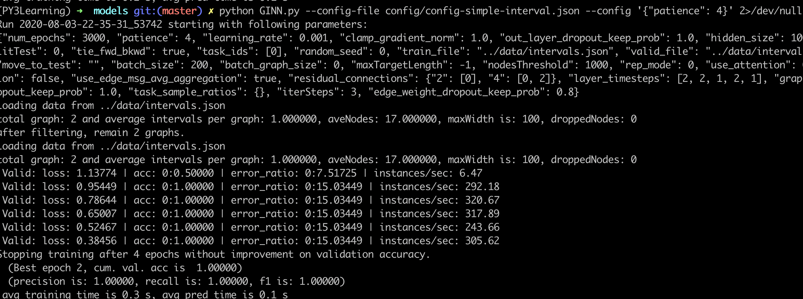
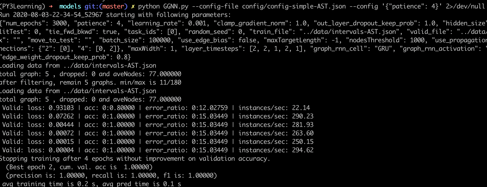

# Graph Interval Neural Network (GINN)

This repository provides the implementation of the graph models proposed in our [paper](https://dl.acm.org/doi/10.1145/3428205).  

The key idea of GINN is to streamline the message-passing procedure based on intervals of control flow graphs. In that sense, the design can be seamlessly incorporated into any graph-based models for learning embeddings of source code. We give two specific instances: [GINN](models/GINN.py) and [GINN-based RNN Sandwich](models/Sandwiches-interval.py). 

## Install

### Prerequisites

- Python 3 

- `pip install -r requirements.txt`

## Models

1. GGNN-based model: in models/GGNN.py

2. GINN model: in models/GINN.py


## Test the models

We have provided sample files to test both models (in [data](/data)).
The format of the sample files are explained in [data/README.md](data/README.md)

Give command like below for running the models: 

```shell
cd models
python GGNN.py --config-file config/config-simple-AST.json
python GINN.py --config-file config/config-simple-interval.json
```

Here are the screenshots of the two models.






## Generaing Intervals
We provide an interval generator [here](https://github.com/GINN-Imp/NeurSA/tree/master/spoon-intervals). The generator parses Java files to CFGs, ASTs and intervals by [Spoon](https://spoon.gforge.inria.fr/).

## Docker Container Setup
Change directories into the one with `Dockerfile`, run the folllowing commands, and follows command in [Test the models](#Test-the-models):
```shell
docker build --tag ginn:1.0 .
docker run -it ginn:1.0 /bin/bash
```
